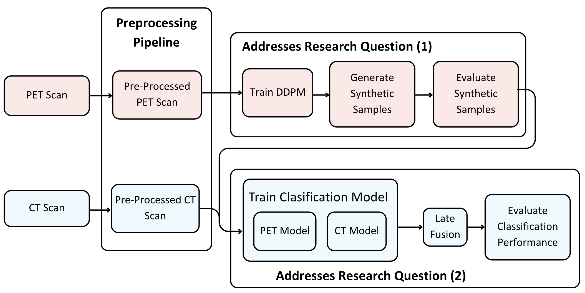
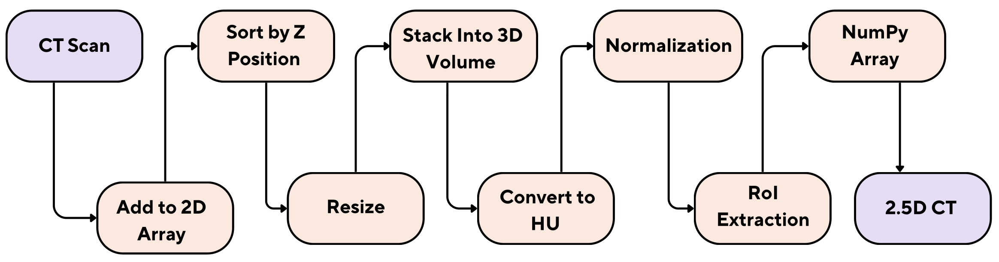
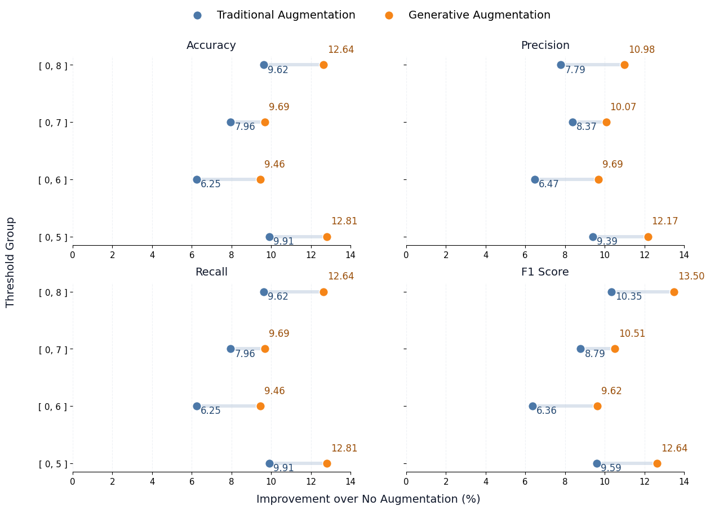
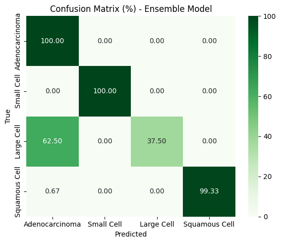

# Generative Augmentation of Anatomical-Functional Imaging for Rare Lung Cancer Subtype Classification

## Overview
This repository contains data pipelines, preprocessing pipelines, and experimental notebooks for generative augmentation techniques and rare lung cancer subtype classification using anatomical (CT) and functional (PET) imaging.

## Experiment Desgin
The project consists of (1) preprocessing CT and PET DICOM series into consistent 2.5D lung-focused NumPy volumes, (2) training generative models to synthesize additional PET samples, and (3) training anatomical, functional and anatiomical-functional (with late-fusion) classifiers to evaluate downstream subtype classification performance. The below figure illustrates the experiment desgin.



*Figure: Experiment Design*

## Repository Structure
The repository is organised into two primary areas: (1) data assets and processing notebooks under `data/`, and (2) experimental code and notebooks under `experiment/`.

```
NeoBreath/
├── README.md
├── requirements.txt
├── img/                           # README figures
├── data/
│   ├── Datasets/
│   │   ├── Lung-PET-CT-Dx/   		# add the dataset here
│   │   └── Generated_PET_up*/      # add generated data here
│   ├── Pipelines/                 	# filter data from the Lung-PET-CT-dx
│   ├── raw/
│   │   ├── CT/                     # raw CT subjects (A, B, E, G)
│   │   └── PET/                    # raw PET subjects (A, B, G)
│   └── preprocessed/
│       ├── CT/                     # preprocessed CT, organised by thresholds
│       └── PET/                    # Preprocessed PET, organised by thresholds
└── experiment/
	├── preprocessing/              # reusable preprocessing pipeline
	├── utils/                      # logging utilities
	├── logs/                       # preprocessing logs
	├── ct_preprocessing.py         # CT preprocessing, runnable
	├── pet_preprocessing.py        # PET preprocessing, runnable
	├── classification/             # classification notebooks (CT, PET, and fusion)
	└── generative-augmentation/    # generative models
```

### Notes on Labels and Splits
- The raw and preprocessed datasets are commonly organised by class folders (e.g., `A/`, `B/`, `E/`, `G/`).
- Experiment notebooks include their own train/validation/test splits and augmentation configurations. When reproducing results, ensure the same split JSON files and random seed (42) are used.

## Environment Setup
### Requirements
- Python 3.9+ is recommended.

### Installation
Create and activate a virtual environment, then install dependencies:

```
pip install -r requirements.txt
```

## Preprocessing (DICOM → 2.5D Lung Regions)
The preprocessing scripts in `experiment/` convert DICOM series into resized, intensity-processed, and trimmed 2.5D volumes saved as `.npy` files.

### PET Preprocessing Pipeline
The PET pipeline sorts slices by Z position, stacks them into a 3D volume, converts intensities to Standardized Uptake Value (SUV), normalizes, extracts a lung-focused region-of-interest (RoI), and outputs a 2.5D representation saved as a NumPy array.


*Figure: PET preprocessing pipeline*

### CT Preprocessing Pipeline
The CT pipeline follows a similar process, with intensity conversion to Hounsfield Units (HU) before normalization and RoI extraction, producing a 2.5D PET NumPy array.



*Figure: CT preprocessing pipeline.*

Data path configuration:
- `data/Datasets/Lung-PET-CT-dx`(The Lung-PET-CT-Dx dataset can be obtained from The Cancer Imaging Archive.)

Dataset preparation and inspection:
- `data/Pipelines/Lung-PET-CT-Dx.ipynb` (dataset preparation and inspection)

Typical entry points:
- `experiment/pet_preprocessing.py` for PET volumes.
- `experiment/ct_preprocessing.py` for CT volumes.

These scripts assume the repository is executed from the project root and expect input data under:
- `data/raw/PET/<CLASS>/<PATIENT>/.../*.dcm`
- `data/raw/CT/<CLASS>/<PATIENT>/.../*.dcm`

Outputs are written under `data/preprocessed/` with threshold-specific subfolders.

## Experiments
Most modelling and analysis is captured in Jupyter notebooks under:
- `experiment/classification/` (CT, PET, and fusion classification experiments)
- `experiment/generative-augmentation/` (diffusion models, checkpoints, evaluation, and visualisations)

## Model Evaluation

- Final test results of the classification models are reported in the fusion notebooks.
- Individual classification notebooks provide detailed evaluation on validation splits, including in-depth performance analysis.

## Results (Figures)

The below figure illustrates the improvement of the evaluation metrics (accuracy, precision, recall, and F1 score) with generative augmentation vs traditional augmentation across thresholds (Impact on functional classifiers).



*Figure: Improvement with generative augmentation vs traditional augmentation across thresholds (accuracy, precision, recall, and F1 score).*

The below figure illustrates the confusion matrix of the best anatmoical-functional classifier which used a probability-based late fusion technique to achieve 98.88% of overall accuracy.



*Figure: Confusion matrix of the best anatomical-functional classification model.*

## Reproducibility and Compute
- Deep learning components (e.g., diffusion models and UNet backbones) typically require a 80 GB VRAM for practical runtimes.
- Some notebooks were authored for hosted notebook environments (e.g., Google Colab Pro) and may contain environment-specific imports or filesystem paths. Adapt paths and runtime settings as needed for local execution.

## Citation

If you use this work, please cite:

```bibtex
@inproceedings{payagalage2026generative,
  author    = {Rumeth Payagalage and Prasan Yapa},
  title     = {Generative Augmentation of Anatomical-Functional Imaging for Rare Lung Cancer Subtype Classification},
  booktitle = {Proceedings of the 19th International Joint Conference on Biomedical Engineering Systems and Technologies - Volume 1: Dual-imaging},
  year      = {2026},
  pages     = {719--724},
  publisher = {SciTePress},
  doi       = {10.5220/0014707100004070}
}
```